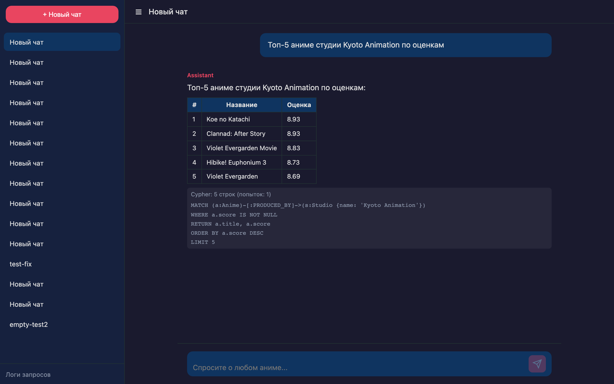
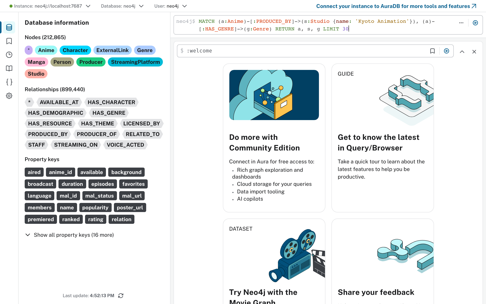

[English](README.md) | [Русский](README.ru.md)

# Anime GraphRAG

Парсер [MyAnimeList](https://myanimelist.net) (HTML-скрапинг) с загрузкой в
графовую БД Neo4j и веб-интерфейсом для запросов на естественном языке.

Scheduler актуализирует текущий, следующий и прошлый сезоны.
Bootstrap проходится по архиву с 1917 года.

212K+ узлов, 899K+ связей — аниме, студии, жанры, персонажи, сэйю, режиссёры.

## Как это выглядит

**GraphRAG UI** — чат с запросами на естественном языке:



**Neo4j Browser** — визуализация графа:



## Примеры вопросов

GraphRAG UI принимает вопросы на русском, генерирует Cypher-запрос к Neo4j
и формулирует ответ. Примеры:

- Кто режиссёр Fullmetal Alchemist: Brotherhood и что он ещё снимал?
- Топ-10 аниме студии Kyoto Animation по оценкам
- Какие жанры у One Piece?
- Сэйю с наибольшим числом ролей
- Какие аниме вышли весной 2024 года?
- Кто озвучивал Гоку?
- Студии с самым высоким средним score
- Какие аниме в жанрах Action и Comedy одновременно?
- Где смотреть Demon Slayer (стриминг)?
- Все персонажи Evangelion

Подробнее — [`docs/popular_cypher_commands.md`](docs/popular_cypher_commands.md).

## Запуск

1. Откройте `.env` в корне, смените `NEO4J_PASSWORD` на свой.
2. Поднимите проект:

   ```bash
   docker compose up -d --build
   ```

3. Проверьте:
   - **Neo4j Browser:** `http://localhost:7474` (логин `neo4j`, пароль из `.env`)
   - **FastAPI:** `http://localhost:8567/docs`
   - **GraphRAG UI:** `http://localhost:8666`
   - **Логи запросов:** `http://localhost:8666/logs`
   - **Prometheus-метрики:** `http://localhost:8666/metrics`

Scheduler запускается автоматически. По умолчанию раз в сутки
(настраивается через `cycle_interval_sec`). Лимиты MyAnimeList
(0.5s между запросами, 55 req/мин) соблюдаются автоматически.

## Первичное наполнение архива (опционально, разово)

Загрузить все аниме с 1917 года (кроме трёх актуальных сезонов — их держит
scheduler):

```bash
docker compose run --rm airing-parser python bootstrap.py
```

Прогресс сохраняется в Neo4j (`title IS NULL` у необработанных тайтлов)
и в файле `parsers/anime/bootstrap_progress.txt`. При прерывании — просто
запустите заново, продолжит с места остановки. Лимиты — ~27 тайтлов/мин
(два запроса на тайтл: основная страница + characters/staff).

## Управление через API

```bash
# Статус
curl http://localhost:8567/status

# Неполные узлы (title IS NULL)
curl http://localhost:8567/stubs

# Принудительно обновить один тайтл
curl -X POST http://localhost:8567/refresh/{mal_id}

# Запустить цикл scheduler прямо сейчас
curl -X POST http://localhost:8567/trigger-cycle

# Изменить интервал автоматического цикла (секунды, минимум 60)
curl -X PUT http://localhost:8567/schedule \
  -H "Content-Type: application/json" \
  -d '{"cycle_interval_sec": 3600}'
```

Полный список эндпоинтов — [`docs/configuration.md`](docs/configuration.md).

## Утилитные скрипты

```bash
# Сверить сезонные страницы с БД и добавить недостающие
docker compose run --rm airing-parser python check_missing.py          # актуальные сезоны
docker compose run --rm airing-parser python check_missing.py --all    # все сезоны (1917→)
```

## Архитектура

```
parsers/                                      backend/
  app.py             — FastAPI + scheduler     main.py      — FastAPI, раздаёт UI
  scheduler_logic.py — один цикл               graphrag.py  — question → Cypher → answer
  discover.py        — регистрация сезонов      db.py        — SQLite: чаты, логи
  processing.py      — обработка одного тайтла
  fetcher.py         — HTTP к MAL + рейт-лимит  frontend/
  mal_scraper.py     — парсер HTML                index.html  — ChatGPT-like UI
  parser.py          — нормализация               style.css
  loader.py          — запись в Neo4j             app.js
  graph_state.py     — очередь/state в Neo4j     logs.html   — таблица логов
  config.py          — config.yaml + env          logs.css
  bootstrap.py       — ручной прогон архива       logs.js
  update_staff.py    — дополнение staff
  check_missing.py   — сверка с MAL             Neo4j
  config.yaml        — параметры                 граф: Anime, Genre, Studio, Producer,
                                              Person, Character, ExternalLink,
                                              StreamingPlatform, Manga
```

Подробнее — [`docs/architecture.md`](docs/architecture.md).

## Документация

| Файл | Что описывает |
|---|---|
| [`docs/architecture.md`](docs/architecture.md) | Архитектура, поток данных, модули |
| [`docs/data-model.md`](docs/data-model.md) | Узлы, связи, индексы Neo4j |
| [`docs/operations.md`](docs/operations.md) | Эксплуатация, мониторинг, ошибки |
| [`docs/configuration.md`](docs/configuration.md) | Конфигурация, API-эндпоинты |
| [`docs/popular_cypher_commands.md`](docs/popular_cypher_commands.md) | 20 примеров Cypher-запросов |
| [`docs/changelog.md`](docs/changelog.md) | Журнал изменений |

## Технологии

- **Neo4j 5** — графовая БД
- **FastAPI** — API парсера и GraphRAG бэкенд
- **Docker Compose** — оркестрация (neo4j, airing-parser, user-anime, user-user, coordinator, graphrag)
- **BeautifulSoup** — HTML-скрапинг MyAnimeList
- **OpenAI-compatible LLM** — text-to-Cypher пайплайн (по умолчанию `glm-5.2`)
- **SQLite** — хранение чатов и логов GraphRAG